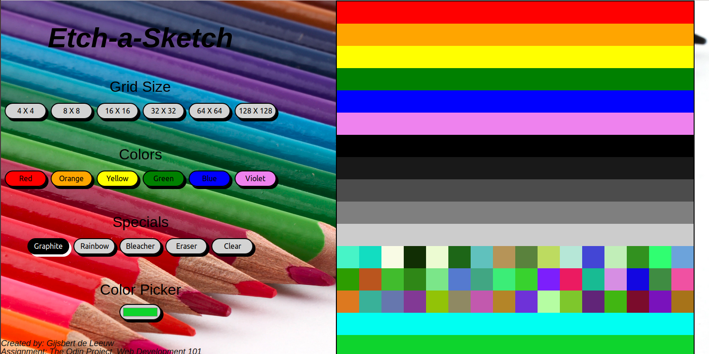

<h1>Etch A Sketch</h1>

<h2>How does it work</h2>

Sketching is done by mousedown events. The program will start with an 16 X 16 block grid and color black.

 
<h2>Features</h2>
<ul>
<li>Grid Sizes: 4 X 4, 8 X 8, 16 X 16, 32 X 32, 64 X 64, 128 X 128.</li>
<li>Fixed Colors: Red, Orange, Yellow, Green, Blue and Violet.</li>
<li>Mono Color: Graphite (black).</li>
<li>Mixing Colors: Rainbow, all colors will be random picked.</li>
<li>Pastels: Can be achieved by diluting the color to white (Bleacher).</li>
<li>Erase: Individual cells can be reset with (erase).</li>
<li>Clear: The whole canvas can be reset with this function (Clear).</li>
</ul>
 

As a Special feature, there is a color picker, thousands of different colors can be compiled.

<h2>This is how it looks like.</h2>

<h2>At another level</h2>

At another level,this game is a study case of 
 <a href="https://www.theodinproject.com/courses/web-development-101">"The Odin Project" course in web-development 101.></a>

I can highly recommend this course because it gives me all the freedom to show my creativity.
 

<h2>Some more ....</h2>
Feel free to use and or copy this program, source code can be found at:  
 <a href="https://github.com/GijsbertdeLeeuw/etch-a-sketch">Github homepage of GijsbertdeLeeuw</a>

<h2> Happy Programming ..... </h2>
